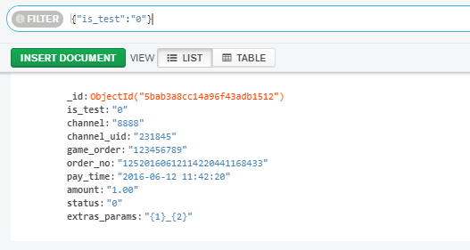

# nodes

## run

`npm install`
`npm start`

## 验证用户信息

- http://127.0.0.1:3000/checkUserAction/checkUserInfo?token=1&uid=1

```json
    // 失败的结果
    {"code":200,"msg":"验证用户信息失败","data":false}
    // 成功的结果
    {"code":200,"msg":"验证用户信息成功","data":true}
```

## 支付回调

- http://127.0.0.1:3000/payCallBackAction/payCallBack

## mongodb



```sql
db.createUser(
   {
     user:"abc",
     pwd:"xxxxx",
     roles:[ "readWrite"]
   }
)
```

## debug

@see  `launch.json`

## api docs

- https://www.quicksdk.com/doc-15.html